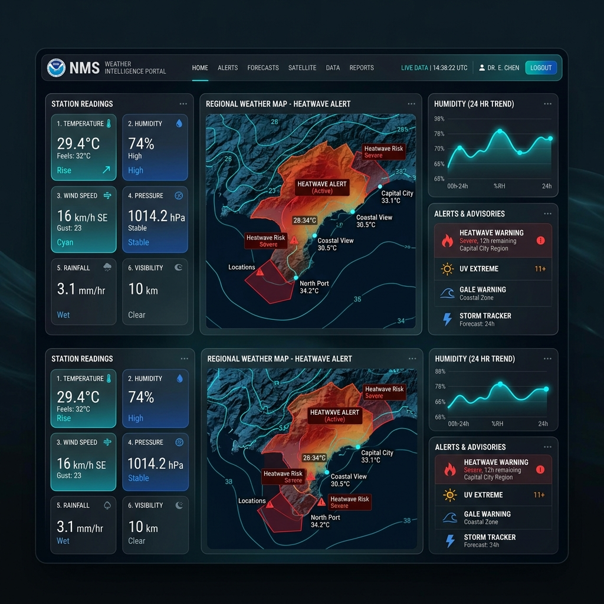
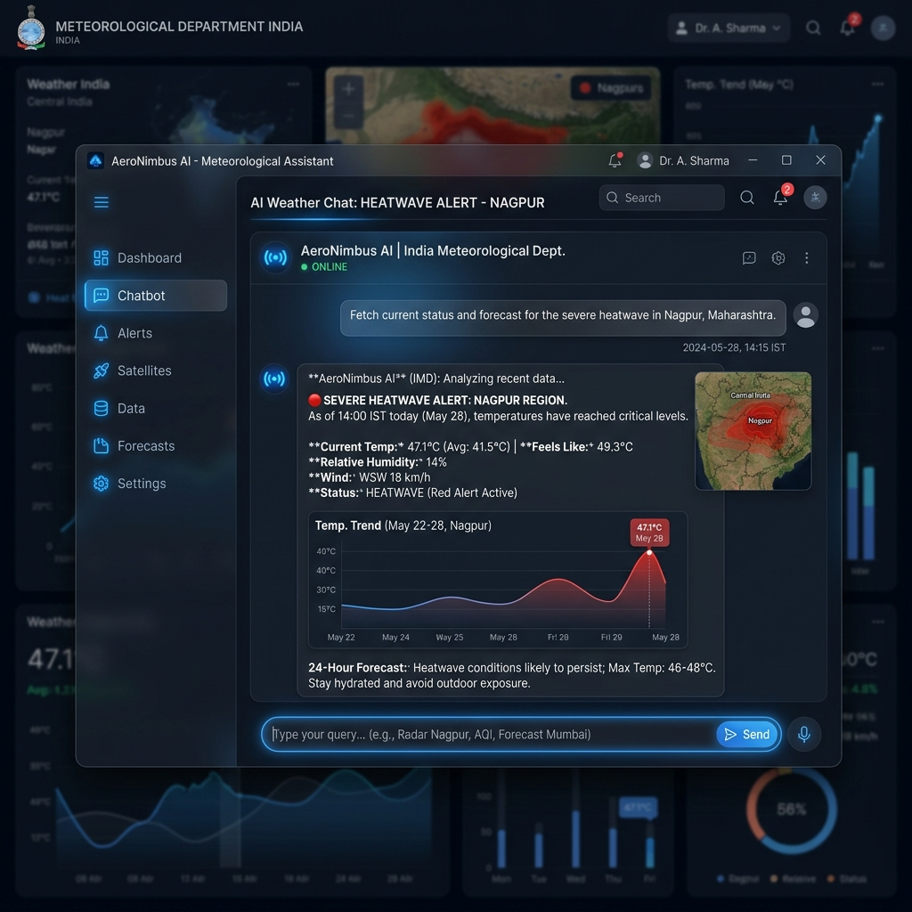
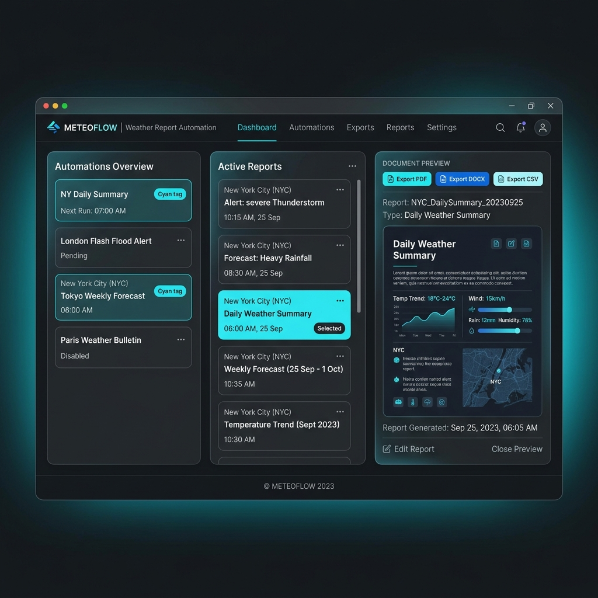

# 🌩️ WeatherDesk — Automated Weather Intelligence Platform

<div align="center">


**A real-time weather analytics, AI-assisted lookup, and report automation platform for government meteorological operations.**

[🌐 Live Admin Dashboard](https://weatherdesk-rmc-nagpur.surge.sh)

</div>

---

## 📸 Screenshots & Architecture

<table>
  <tr>
    <td align="center">
      
      <br/><b>🖥️ Live Weather Dashboard</b>
      <br/><sub>Real-time analytics, Vidarbha region data, heatwave alerts</sub>
    </td>
    <td align="center">
      
      <br/><b>🤖 RMC AI Assistant</b>
      <br/><sub>Automated queries, alert tracking, NLP-driven insights</sub>
    </td>
  </tr>
  <tr>
    <td align="center">
      
      <br/><b>🏗️ System Architecture</b>
      <br/><sub>React + Vite frontend, Express mock backend, API Gateway</sub>
    </td>
    <td align="center">
      
      <br/><b>📄 Report Automation & Exports</b>
      <br/><sub>1-click official bulletins, PDF/DOCX/CSV generation</sub>
    </td>
  </tr>
</table>

---

## 📋 Table of Contents

- [Overview](#-overview)
- [Key Features](#-key-features)
- [System Architecture](#-system-architecture)
- [Tech Stack](#-tech-stack)
- [Project Structure](#-project-structure)
- [Setup & Deployment](#-setup--deployment)
- [Internship Details](#-internship-details)

---

## 🌟 Overview

**WeatherDesk** is a production-grade automated weather report management and analytics platform developed for the Regional Meteorological Centre (RMC), Nagpur. It enables:

- **Live weather tracking** across 12 Vidarbha districts using dynamic data modeling.
- **Auto-generated official weather bulletins** customized for daily and weekly publishing.
- **Instant multi-format exports** directly to PDF, DOCX, CSV, JSON, and PNG.
- **An on-device AI Chatbot** for retrieving real-time data insights without leaving the application.

---

## ✨ Key Features

### 🗺️ RMC Control Center
| Feature | Description |
|---------|-------------|
| **Live Dashboard** | Real-time temperature stats, humidity, rainfall, and hover-triggered city popups |
| **Alert Management** | Red, Orange, and Yellow heatwave alerts calculated dynamically |
| **Report Automation** | 1-click generation of government-standard text weather bulletins |
| **Document Exporting** | Client-side export to fully formatted PDF or editable DOCX formats |
| **Social Sharing** | Send quick alerts out to X/Twitter, WhatsApp, Facebook, or Telegram |

### 🤖 Intelligence & Analytics
| Feature | Description |
|---------|-------------|
| **AI Assistant (Chatbot)** | Instantly process queries like "Show alerts" or "What is the max temp in Nagpur?" |
| **Trend Analytics** | Recharts-powered graphs comparing historical data vs live incoming metrics |
| **Dynamic Data Engine** | Express backend generating highly realistic summer conditions for Vidarbha |

---

## 🏗️ System Architecture

```text
┌─────────────────────────────────────────────────────────────┐
│                      FRONTEND PWA                           │
│  React 18 → TailwindCSS → Framer Motion → lucide-react      │
└──────────────────┬──────────────────────────────────────────┘
                   │  REST API Calls (fetch)
┌──────────────────▼──────────────────────────────────────────┐
│                  EXPRESS BACKEND                             │
│                                                              │
│  Endpoints:                                                  │
│  ├── /api/weather   (Live dynamic weather feed)              │
│  ├── /api/forecast  (7-day predictive models)                │
│                                                              │
│  Mock Generation Engine:                                     │
│  ├── randomizes temps between 40-47°C                        │
│  ├── injects dynamic heatwave alerts                         │
│  └── simulates 0-15mm rainfall variables                     │
└──────────────────┬──────────────────────────────────────────┘
                   │  Static Build Pipeline
┌──────────────────▼──────────────────────────────────────────┐
│              PRODUCTION DEPLOYMENT                           │
│  Express statically serves frontend/dist for 1-click deploy  │
└─────────────────────────────────────────────────────────────┘
```

---

## 🛠️ Tech Stack

| Layer | Technology |
|-------|-----------|
| **Frontend Framework** | React 18 + Vite |
| **Styling** | TailwindCSS + PostCSS + Glassmorphism |
| **Animations** | Framer Motion |
| **Icons & Charts** | Lucide React + Recharts |
| **Backend API** | Node.js + Express.js + CORS |
| **Export Utilities** | jsPDF, html2canvas, docx, file-saver |
| **Hosting (Target)** | Render / Heroku / Vercel |

---

## 🚀 Setup & Deployment

### Prerequisites
- Node.js 18+
- npm or yarn

### 1. Clone & Install
```bash
git clone https://github.com/YOUR_USERNAME/weatherdesk-rmc-nagpur.git
cd weatherdesk-rmc-nagpur

# Install all dependencies across backend and frontend
npm run install:all
```

### 2. Build for Production
```bash
# Compile and optimize the React frontend
npm run build
```

### 3. Run the Unified Server
```bash
# Starts the backend API and serves the frontend on the same port!
npm start
```
*The app will be available on port 3001.*

---

## 📝 Internship Details

- **Project**: WeatherDesk
- **Organization**: Regional Meteorological Centre, Nagpur | India Meteorological Department (IMD)
- **Ministry**: Ministry of Earth Sciences, Government of India
- **Period**: 25 May 2026 – 30 June 2026

---

<div align="center">

Built with ❤️ for meteorological intelligence and community safety.

**WeatherDesk** — *Data-driven forecasting.*

</div>
