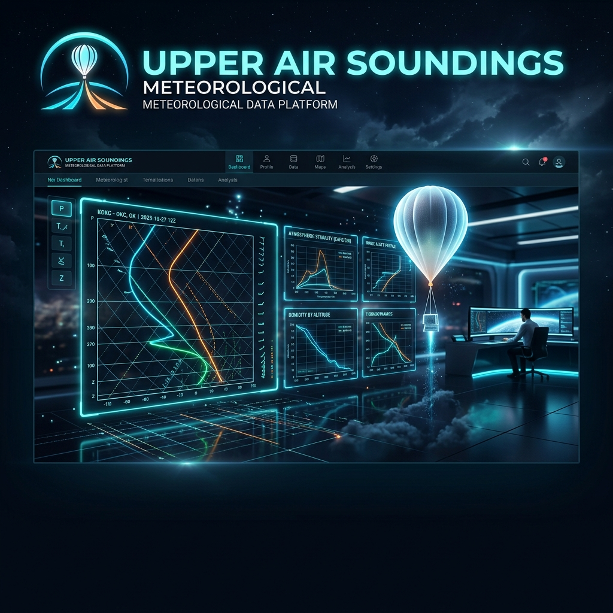
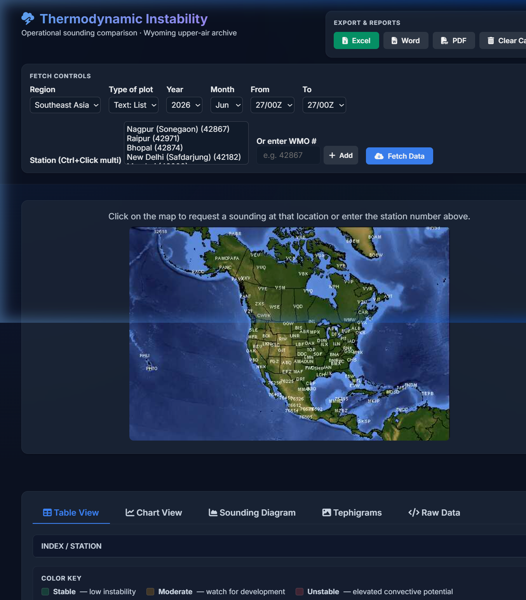
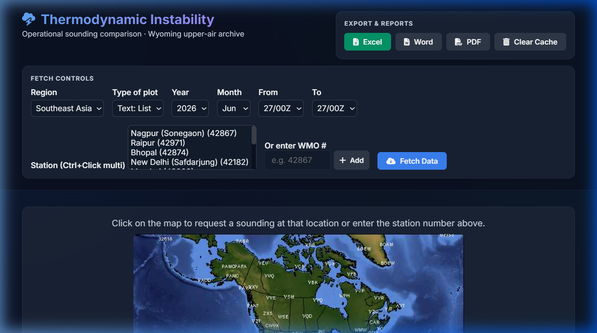
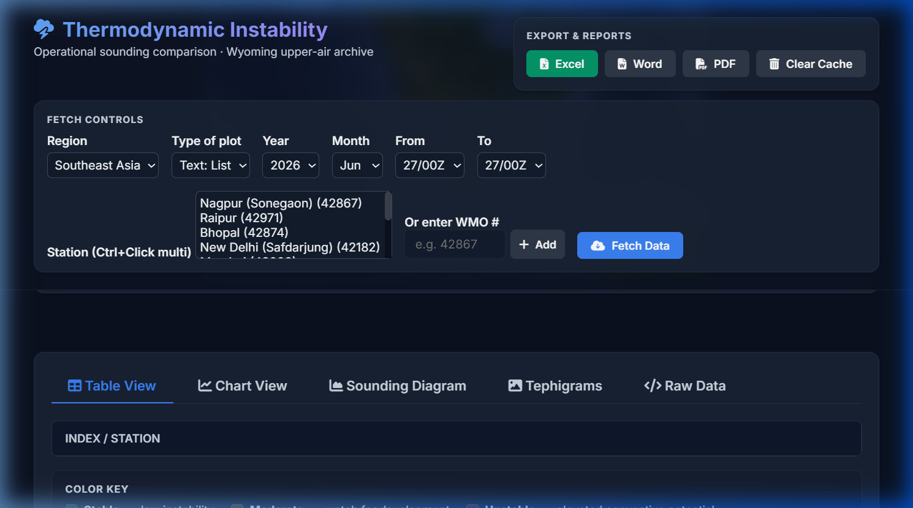
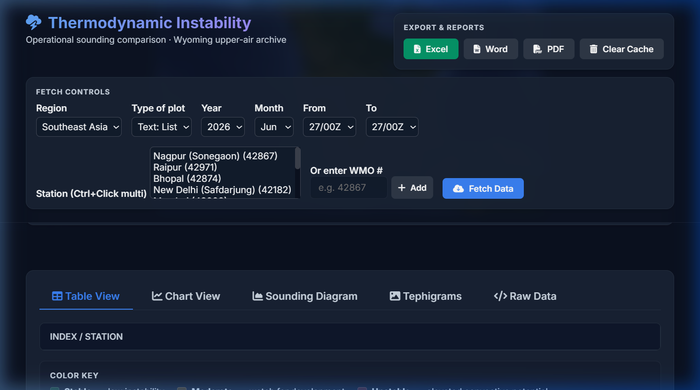

# ⛈️ Upper Air Soundings



<div align="center">


**A production-grade platform for fetching, parsing, and visualizing Upper Air Soundings. Features multi-station comparison, interactive Skew-T diagrams, and server-rendered tephigrams.**

[🌐 Live Web Demo](https://your-app.vercel.app) · [💻 Download Desktop App](#-setup--deployment)

</div>

---

## 📸 Screenshots

<table>
  <tr>
    <td align="center">
      
      <br/><b>🖥️ Main Dashboard</b>
      <br/><sub>Multi-station control panel and severity-coded indices</sub>
    </td>
    <td align="center">
      
      <br/><b>🗺️ Interactive Skew-T/Log-P</b>
      <br/><sub>Dry/moist adiabats, parcel paths, and wind hodographs</sub>
    </td>
  </tr>
  <tr>
    <td align="center">
      
      <br/><b>📊 Visual Analytics</b>
      <br/><sub>Bar chart comparisons and time-series trend analysis</sub>
    </td>
    <td align="center">
      
      <br/><b>🌡️ Server-Rendered Tephigrams</b>
      <br/><sub>High-accuracy plotting via the Python Tephi library</sub>
    </td>
  </tr>
</table>

---

## 📋 Table of Contents

- [Overview](#-overview)
- [Key Features](#-key-features)
- [Severity Thresholds](#-severity-thresholds)
- [System Architecture](#-system-architecture)
- [Tech Stack](#-tech-stack)
- [Project Structure](#-project-structure)
- [Setup & Deployment](#-setup--deployment)
- [License](#-license)

---

## 🌟 Overview

The Thermodynamic Instability Dashboard is an operational web and desktop application designed for meteorologists and weather enthusiasts. It processes raw atmospheric sounding data from the University of Wyoming's Upper Air archive and converts it into actionable, highly visual analytics.

It supports:
- **Real-time parsing** of 25+ instability indices (CAPE, CIN, Lifted Index, SWEAT, etc.)
- **Multi-station comparison** across various geographic regions.
- **Graceful degradation** and resilient fetching with exponential backoff.
- **True cross-platform** capability: run it as a serverless web app on Vercel, or as a standalone native Desktop app via Electron.

---

## ✨ Key Features

### 🖥️ Visualization & Analytics
| Feature | Description |
|---------|-------------|
| **Interactive Skew-T/Log-P** | Client-side SVG rendering with parcel path tracing, CAPE/CIN shading, and wind barbs. |
| **Server-Rendered Tephigrams** | Precise thermodynamic diagrams generated by the Python `tephi` library. |
| **Multi-Station Comparison** | Select multiple stations and compare their instability indices side-by-side. |
| **Severity Color Coding** | Values are classified as Stable (green), Moderate (amber), or Unstable (red). |
| **Chart.js Visualizations** | Dynamic bar charts for cross-station comparison and line charts for temporal trends. |

### 🛠️ Operational Tools
| Feature | Description |
|---------|-------------|
| **1-Click Excel Export** | Client-side `.xlsx` generation retaining severity color coding. |
| **Local Data Caching** | Sounding data is aggressively cached in `localStorage` to save network requests. |
| **PWA & Offline Support** | Installable on mobile/desktop with a Service Worker for offline resilience. |
| **Network Resilience** | Built-in exponential backoff for transient network failures. |

---

## 📊 Severity Thresholds

| Index | Stable (Green) | Moderate (Amber) | Unstable (Red) |
|-------|----------------|------------------|----------------|
| **CAPE** | < 300 J/kg | 300 – 2500 | > 2500 |
| **CIN** | > −50 J/kg | −200 to −50 | < −200 |
| **Lifted Index** | > 0 | −3 to 0 | < −3 |
| **K-Index** | < 20 | 20 – 29 | ≥ 30 |
| **Showalter** | > 3 | 0 to 3 | < 0 |
| **SWEAT** | < 150 | 150 – 300 | > 300 |
| **Precip. Water** | < 30 mm | 30 – 50 | > 50 |

---

## 🏗️ System Architecture

```text
┌─────────────────────────────────────────────────────────────┐
│                   ELECTRON DESKTOP APP                      │
│  Spawns Local Python Backend → Renders UI → Fetches Data    │
└──────────────────┬──────────────────────────────────────────┘
                   │  Or hosted via Vercel
┌──────────────────▼──────────────────────────────────────────┐
│               VERCEL CLOUD HOSTING                           │
│                                                              │
│  Static Assets (CDN):                                        │
│  ├── index.html, style.css, app.js                           │
│  └── PWA Manifest & Service Worker                           │
│                                                              │
│  Serverless Functions (Python 3.8+):                         │
│  ├── /api/sounding    (Proxies Wyoming API & Parses Data)    │
│  └── /api/region_map  (Proxies Interactive Station Maps)     │
└──────────────────┬──────────────────────────────────────────┘
                   │  Outbound HTTP fetch
┌──────────────────▼──────────────────────────────────────────┐
│          UNIVERSITY OF WYOMING UPPER AIR ARCHIVE            │
│  Text format sounding data & raw HTML station maps          │
└─────────────────────────────────────────────────────────────┘
```

---

## 🛠️ Tech Stack

| Layer | Technology |
|-------|-----------|
| **Frontend** | Vanilla HTML5 / CSS3 / JavaScript (ES2020) |
| **Styling** | Custom CSS variables, dark theme, glassmorphism UI |
| **Charts** | Chart.js + annotation plugin |
| **Exports** | xlsx-js-style |
| **Backend/Proxy** | Python (Flask for local/desktop, Serverless for Vercel) |
| **Diagrams** | `tephi` (Python) and custom SVG renderers (JS) |
| **Hosting** | Vercel (Free tier compatible) |
| **Desktop App** | Electron |

---

## 📁 Project Structure

```text
thermodynamics-instability/
├── index.html              # Main dashboard UI
├── style.css               # Design system
├── 📁 js_modules/          # Core JavaScript
│   ├── app.js              # Orchestration (events, state)
│   ├── parser.js           # Sounding text parsing
│   ├── skewt.js            # SVG Skew-T/Log-P & Hodograph
│   └── ...                 # Cache, models, stations, charts
│
├── 📁 api/                 # Vercel Serverless Functions
│   ├── sounding.py         # Data fetching & proxy
│   └── region_map.py       # Station map proxy
│
├── 📁 backend/             # Local/Desktop Flask Backend
│   ├── server.py           # Standalone Flask server
│   └── requirements.txt    # Python dependencies
│
├── 📁 electron/            # Desktop Application
│   ├── main.js             # Electron main process (auto-spawns Flask)
│   ├── preload.js          # Secure IPC bridging
│   └── package.json        # Build configuration
│
├── vercel.json             # Vercel deployment config
├── requirements.txt        # Root Python deps for Vercel
├── manifest.json           # PWA config
└── sw.js                   # Service Worker
```
*(Note: Some JavaScript files reside in the root directory in the actual codebase for ease of static serving.)*

---

## 🚀 Setup & Deployment

### Option 1: Vercel Web Deployment (Recommended)

1. Fork this repository.
2. Sign in to [Vercel](https://vercel.com/) and create a new project from your fork.
3. Vercel will automatically detect the `vercel.json` and deploy both the frontend and the Python serverless backend.
4. **Note:** Vercel's free tier has a 250MB limit. The Tephigram rendering feature degrades gracefully if heavy Python dependencies (`matplotlib`) exceed this limit, leaving all other features fully operational.

### Option 2: Run as a Standalone Desktop App (Electron)

**Prerequisites:** Node.js 18+ and Python 3.8+ installed on your machine.

```bash
# 1. Install root dependencies (if any)
npm install

# 2. Setup the Python backend
cd backend
pip install -r requirements.txt

# 3. Build and run the Desktop App
cd ../electron
npm install
npm start
```
To build a portable `.exe` installer for Windows:
```bash
npm run build
```

### Option 3: Local Development (Web)

```bash
# Terminal 1: Start the backend
cd backend
pip install -r requirements.txt
python server.py

# Terminal 2: Serve the frontend
cd ..
python -m http.server 8000
```
Open `http://localhost:8000` in your browser.

---

## 📄 License

MIT License — Free to use for educational, research, and non-commercial purposes.

---

<div align="center">

Built with ❤️ for meteorologists and atmospheric science enthusiasts. 
Sounding data proudly sourced from the **University of Wyoming**.

</div>
